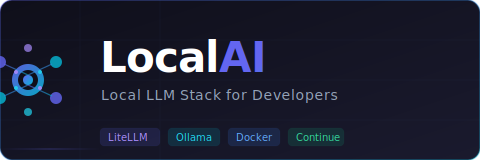
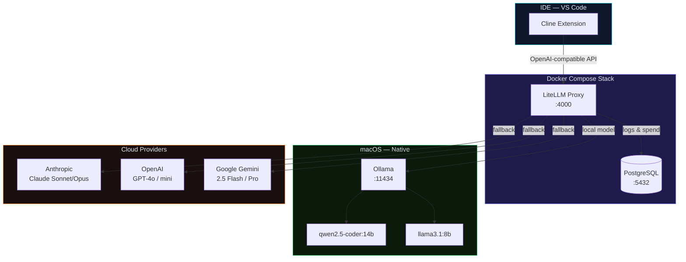
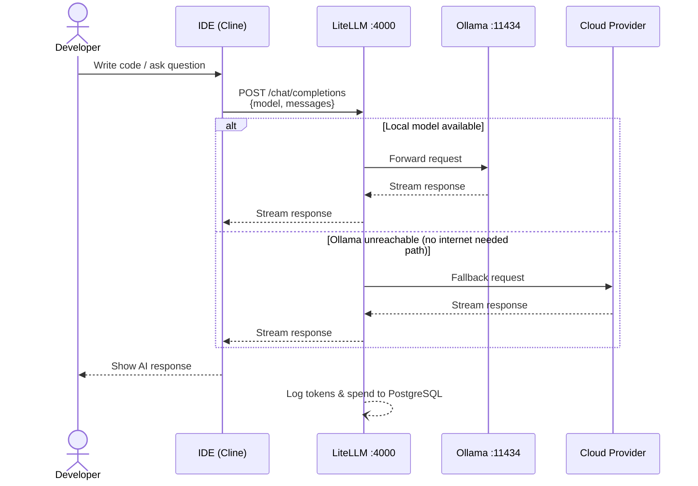
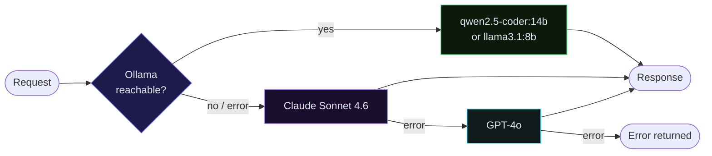
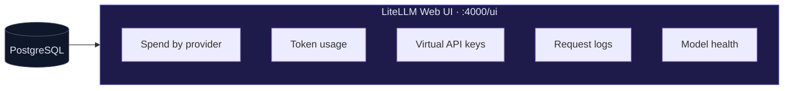

<p align="center">
  
</p>

<p align="center">
  <a href="LICENSE"></a>
  
  
  
  
</p>

<p align="center">
  <strong>A production-ready local AI stack for developers.</strong><br/>
  Unified proxy for local and cloud LLMs · Offline-first · IDE agent integration via Cline
</p>

---

## Overview

**LocalAI Stack** gives every developer on your team a single endpoint (`localhost:4000`) that transparently routes requests to:

- **Local models** via Ollama (works fully offline, Apple Metal GPU acceleration)
- **Cloud providers** — Anthropic, OpenAI, Google Gemini — when internet is available

The stack handles automatic fallback: if a local model fails or is unavailable, it silently escalates to the next configured provider. Cline (and any OpenAI-compatible client) only needs to know about one URL and one API key.

---

## Architecture



### Component summary

| Component | Role | Port |
|-----------|------|------|
| **LiteLLM** | Unified OpenAI-compatible proxy. Routes requests, handles fallbacks, tracks spend | `4000` |
| **PostgreSQL** | Persistent storage for LiteLLM: logs, API keys, spend metrics | internal |
| **Ollama** | Runs local LLMs using Apple Metal (native macOS, not containerised) | `11434` |

---

## Request flow



---

## Fallback chain



---

## Prerequisites

### Software

| Requirement | Version | Notes |
|-------------|---------|-------|
| **macOS** | 13+ | Apple Silicon (M1–M5) strongly recommended |
| **Docker Desktop** | 4.x+ | Must be running before `setup.sh` |
| **Ollama** | 0.1.x+ | Install from [ollama.com](https://ollama.com/download) |

### Hardware — RAM requirements per local model

Local LLMs must fit **entirely in memory** before inference begins. On Apple Silicon, unified memory means all RAM is available (no separate GPU VRAM limit). If a model doesn't fit, Ollama falls back to swap — 10–50× slower and effectively unusable.

| Model | Model size | Min RAM | Recommended RAM | Notes |
|-------|-----------|---------|-----------------|-------|
| `qwen2.5-coder:7b` | ~5 GB | **8 GB** | 16 GB | Safe on any modern Mac |
| `qwen2.5-coder:14b` | ~9 GB | **16 GB** | 24 GB+ | Best quality; recommended default |
| `qwen2.5-coder:32b` | ~20 GB | **32 GB** | 48 GB+ | Needs a high-spec machine |
| `llama3.1:8b` | ~5 GB | **8 GB** | 16 GB | General purpose, not code-specialised |
| `llama3.1:70b` | ~40 GB | **64 GB** | — | Not viable on consumer hardware |

> **Intel Macs**: Ollama uses CPU inference regardless of model size — models run but are significantly slower than Apple Silicon.

Run `bash check.sh` before setup to see which models are compatible with your exact hardware.

### API keys (optional — required for cloud fallback)

| Provider | Variable | Get key |
|----------|----------|---------|
| Anthropic | `ANTHROPIC_API_KEY` | [console.anthropic.com](https://console.anthropic.com) |
| OpenAI | `OPENAI_API_KEY` | [platform.openai.com](https://platform.openai.com) |
| Google | `GEMINI_API_KEY` | [aistudio.google.com](https://aistudio.google.com) |

> The stack works **fully offline** with only Ollama — cloud keys are optional.

---

## Quick start

```bash
# 1. Clone the repo
git clone https://github.com/your-org/localai.git
cd localai

# 2. (Recommended) Verify your hardware is compatible
bash check.sh

# 3. Run the setup wizard
bash setup.sh
```

The setup wizard will:
1. Verify Docker and Ollama are installed and running
2. Ask which cloud providers you want to configure (Anthropic / OpenAI / Google / none)
3. Prompt for each selected API key and generate a LiteLLM master key
4. Show a model selection menu filtered to models that fit your RAM
5. Download the chosen local model (skipped if already present)
6. Start the Docker Compose stack and wait for LiteLLM to be healthy
7. Print access URLs and ready-to-use Cline configuration

### Access URLs

| Service | URL | Description |
|---------|-----|-------------|
| **LiteLLM API** | http://localhost:4000 | OpenAI-compatible endpoint |
| **LiteLLM Web UI** | http://localhost:4000/ui | Dashboard: logs, spend, models, keys |

---

## Stopping the stack

```bash
bash stop.sh
```

This stops all Docker containers **and** the Ollama process.

To stop only Docker (keep Ollama running):

```bash
docker compose down
```

---

## Available models

### Local (Ollama)

| Model | Size | Best for |
|-------|------|----------|
| `qwen2.5-coder:14b` | ~9 GB | Code completion, generation, review |
| `qwen2.5-coder:7b` | ~5 GB | Faster completions on lower RAM |
| `llama3.1:8b` | ~5 GB | Agent tasks, function calling |

Pull additional models:

```bash
ollama pull mistral:7b
ollama pull deepseek-coder-v2:16b
```

### Cloud (via LiteLLM)

| Model name | Provider | Notes |
|------------|----------|-------|
| `claude-sonnet-4-6` | Anthropic | Best for agent / agentic coding |
| `claude-opus-4-8` | Anthropic | Most capable, slower |
| `gpt-4o` | OpenAI | Strong general purpose |
| `gpt-4o-mini` | OpenAI | Fast, economical |
| `gemini-2.5-flash` | Google | Fast multimodal |
| `gemini-2.5-pro` | Google | Most capable Gemini |

---

## IDE integration

### Cline (VS Code)

Cline is the recommended IDE agent for this stack. It supports full agentic mode — file editing, terminal commands, browser control — using cloud models routed through LiteLLM.

**Setup:**

1. Install the **Cline** extension (`saoudrizwan.claude-dev`) from the VS Code Marketplace
2. Open the Cline panel → gear icon ⚙️ → **API Configuration**
3. Fill in:

| Field | Value |
|-------|-------|
| **API Provider** | `OpenAI Compatible` |
| **Base URL** | `http://localhost:4000` |
| **API Key** | your `LITELLM_MASTER_KEY` (shown at the end of `bash setup.sh`) |
| **Model** | `claude-sonnet-4-6` (recommended) |

**Which model to use in Cline:**

| Use case | Model | Why |
|----------|-------|-----|
| Agent mode (edit files, run terminal) | `claude-sonnet-4-6` | Reliable tool-use support |
| Large context / complex tasks | `claude-opus-4-8` | Highest capability |
| Quick offline chat | `qwen2.5-coder:14b` | Free, no internet needed |
| Fast cloud responses | `gpt-4o-mini` | Low latency, economical |

> **Why not local models for agent mode?** Ollama models do not reliably execute the structured tool calls that Cline requires for agentic tasks (file edits, terminal). They work well for chat and code completion but will often fail or hallucinate tool responses in agent mode. Use a cloud model for agentic work; local models for offline chat.

### Direct API (curl / scripts)

```bash
export LITELLM_KEY=<your LITELLM_MASTER_KEY>

# Chat completion
curl http://localhost:4000/v1/chat/completions \
  -H "Authorization: Bearer $LITELLM_KEY" \
  -H "Content-Type: application/json" \
  -d '{
    "model": "qwen2.5-coder:14b",
    "messages": [{"role": "user", "content": "Write a Python hello world"}]
  }'

# List available models
curl http://localhost:4000/v1/models \
  -H "Authorization: Bearer $LITELLM_KEY"
```

---

## Configuration

### Environment variables (`.env`)

| Variable | Required | Description |
|----------|----------|-------------|
| `ANTHROPIC_API_KEY` | No | Anthropic Claude API key |
| `OPENAI_API_KEY` | No | OpenAI API key |
| `GEMINI_API_KEY` | No | Google Gemini API key |
| `LITELLM_MASTER_KEY` | Yes | Master key to authenticate against LiteLLM |
| `LITELLM_SALT_KEY` | Yes | Salt for encrypting keys stored in DB (generate with `openssl rand -hex 32`) |
| `POSTGRES_PASSWORD` | Yes | PostgreSQL password for the LiteLLM database |

### Changing the default local model

```bash
LOCAL_MODEL=qwen2.5-coder:7b bash setup.sh
```

### Adding a new provider or model

Edit `litellm/config.yaml`:

```yaml
model_list:
  - model_name: my-custom-model
    litellm_params:
      model: ollama/my-custom-model
      api_base: http://host.docker.internal:11434
```

Then restart LiteLLM:

```bash
docker compose restart litellm
```

---

## Monitoring & spend tracking

Open the LiteLLM Web UI at **http://localhost:4000/ui** (login with your `LITELLM_MASTER_KEY`).



Key views:
- **Dashboard** — spend by provider, top models, request volume
- **Logs** — full request/response history with latency and token counts
- **Virtual Keys** — create per-developer API keys with spend limits
- **Models** — live health check for every configured endpoint

---

## Troubleshooting

### LiteLLM does not start

```bash
docker compose logs litellm --tail=50
```

Most common cause: missing or malformed `.env`. Verify all required variables are set.

### A cloud provider returns errors

```bash
# Check health of all endpoints
source .env
curl -H "Authorization: Bearer $LITELLM_MASTER_KEY" http://localhost:4000/health
```

Look for `unhealthy_endpoints` in the response for details on which provider is failing.

### Ollama model is slow

- Ensure no other memory-heavy apps are running
- Try a smaller model: `LOCAL_MODEL=qwen2.5-coder:7b bash setup.sh`
- Check Ollama is using Metal: `ollama ps` should show `100% GPU`

### Port already in use

```bash
# Find what is using port 4000
lsof -i :4000
```

---

## Project structure

```
localai/
├── docker-compose.yml   # Service definitions
├── litellm/
│   └── config.yaml      # LiteLLM model list, router and fallback config
├── assets/
│   └── logo.svg         # Project logo
├── .env.example         # Environment variable template
├── check.sh             # Pre-flight hardware & dependency checker
├── setup.sh             # Interactive setup wizard (providers, models, .env)
├── stop.sh              # Graceful shutdown script
└── README.md            # This file
```

---

## Contributing

Contributions, issues and feature requests are welcome.

1. Fork the repository
2. Create a feature branch: `git checkout -b feat/my-feature`
3. Commit your changes: `git commit -m "feat: add my feature"`
4. Push: `git push origin feat/my-feature`
5. Open a Pull Request

---

## License

This project is licensed under the **MIT License** — see the [LICENSE](LICENSE) file for details.

---

<p align="center">
  Built with ❤️ for the developer community · <a href="https://github.com/your-org/localai">GitHub</a>
</p>
